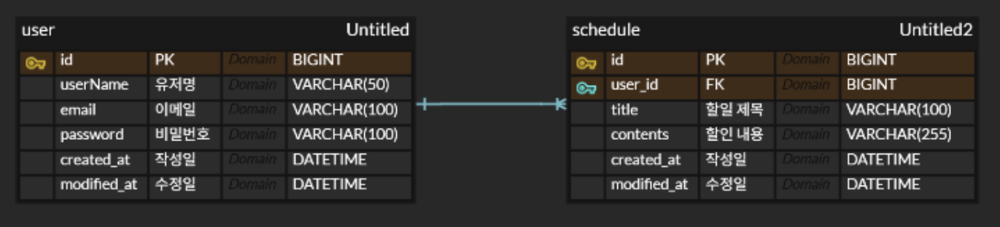

> #  🗓️ Schedule Develop Project

> ## 👨‍🏫 프로젝트 소개

#### 이 프로젝트는 Spring Boot와 JPA 를 활용하여 일정 등록, 조회, 수정, 삭제 기능을 구현한 일정 관리 애플리케이션이다.
#### 3 Layer Architecture를 기반으로 Controller, Service, Repository의 역할을 분리하여 개발하였으며, MySQL과 연동하여 일정 데이터를 관리한다.

> ## 📐 설계
### 1. API 명세서

<details>
<summary> 일정 API 명세 </summary>

### 일정 생성

- **Method**: `POST`
- **URL**: `/schedules`
- **Request Body**
```json
{
  "userName": "홍길동",
  "title": "회의 준비",
  "contents": "회의 자료 정리하기"
}
```
- **Response Body**
```json
{
  "id": 1,
  "userName": "홍길동",
  "title": "회의 준비",
  "contents": "회의 자료 정리하기",
  "created_at": "2026-04-21T10:00:00",
  "modified_at": "2026-04-21T10:00:00"
}
```
- **Status Code**
  - Success: `201 Created`
  - Error: `400 Bad Request`

---

### 일정 전체 조회
- **Method**: `GET`
- **URL**: `/schedules`
- **Response Body**
```json
[
  {
    "id": 1,
    "userName": "홍길동",
    "title": "회의 준비",
    "contents": "회의 자료 정리하기",
    "created_at": "2026-04-21T10:00:00",
    "modified_at": "2026-04-21T10:00:00"
  }
]
```
- **Status Code**
  - Success: `200 OK`
  - Error: `400 Bad Request`

---

### 일정 단건 조회
- **Method**: `GET`
- **URL**: `/schedules/{id}`
- **Path Variable**: `id`
- **Response Body**
```json
{
  "id": 1,
  "userName": "홍길동",
  "title": "회의 준비",
  "contents": "회의 자료 정리하기",
  "created_at": "2026-04-21T10:00:00",
  "modified_at": "2026-04-21T10:00:00"
}
```
- **Status Code**
  - Success: `200 OK`
  - Error: `400 Bad Request`

---

### 일정 수정
- **Method**: `PATCH`
- **URL**: `/schedules/{id}`
- **Path Variable**: `id`
- **Request Body**
```json
{
  "title": "수정된 일정 제목",
  "contents": "수정된 일정 내용"
}
```
- **Response Body**
```json
{
  "id": 1,
  "userName": "홍길동",
  "title": "수정된 일정 제목",
  "contents": "수정된 일정 내용",
  "created_at": "2026-04-21T10:00:00",
  "modified_at": "2026-04-21T12:30:00"
}
```
- **Status Code**
  - Success: `200 OK`
  - Error: `400 Bad Request`

---

### 일정 삭제
- **Method**: `DELETE`
- **URL**: `/schedules/{id}`
- **Path Variable**: `id`
- **Response Body**: 없음
- **Status Code**
  - Success: `204 No Content`
  - Error: `400 Bad Request`

</details>


### 2. ERD



> ## 📌 주요기능

### 


> ## ⏲️ 개발기간
- 2026.04.20(월) ~ 2026.04.23(목)

> ## 📚️ 기술스택

### ✔️ Language
- Java 17

### ✔️ Framework
- Spring Boot
- Spring Web
- Spring Data JPA

### ✔️ Database
- MySQL

### ️️ ✔️ Library
- Lombok

### ✔️ IDE
- IntelliJ IDEA

### ✔️ Version Control
- Git
- GitHub

> ## 🔥 Trouble Shooting
