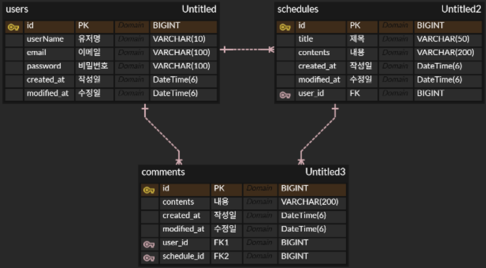

> ##  🗓️ Schedule Develop Project

> ### 👨‍🏫 프로젝트 소개

#### 이 프로젝트는 Spring Boot와 JPA 를 활용하여 일정 등록, 조회, 수정, 삭제 기능을 구현한 일정 관리 애플리케이션이다.
#### 기존 일정 CRUD 기능에서 확장하여 **유저 관리**, **로그인/로그아웃**, **댓글 기능**, **예외 처리**, **비밀번호 암호화**, **페이지네이션**까지 단계적으로 구현했다.
#### 3 Layer Architecture를 기반으로 Controller, Service, Repository의 역할을 분리하여 개발하였으며, MySQL과 연동하여 일정 데이터를 관리한다.

> ### 📐 설계
#### 1. API 명세서

<details>
<summary> 일정 API 명세 </summary>

#### 일정 생성

- **Method**: `POST`
- **URL**: `/schedules`

- **Request Body**
```json
{
  "userId": 1,
  "title": "회의 준비",
  "contents": "회의 자료 정리하기"
}
```

- **Response Body**
```json
{
  "id": 1,
  "userId": 1,
  "title": "회의 준비",
  "contents": "회의 자료 정리하기",
  "createdAt": "2026-04-23T10:00:00",
  "modifiedAt": "2026-04-23T10:00:00"
}
```

- **Status Code**
  - Success: `201 Created`
  - Error: `400 Bad Request`
  - Error: `404 Not Found`

- **Error Case**
  - `userId`가 누락된 경우
  - 일정 제목이 비어 있는 경우
  - 일정 제목이 50자를 초과하는 경우
  - 일정 내용이 비어 있는 경우
  - 일정 내용이 200자를 초과하는 경우
  - 존재하지 않는 유저 ID로 일정 생성을 요청한 경우

- **Error Response Example**
```json
{
  "status": 400,
  "message": "userId는 필수입니다."
}
```

```json
{
  "status": 400,
  "message": "일정 제목은 필수입니다."
}
```

```json
{
  "status": 400,
  "message": "일정 제목은 50자 이하여야 합니다."
}
```

```json
{
  "status": 400,
  "message": "일정 내용은 필수입니다."
}
```

```json
{
  "status": 400,
  "message": "일정 내용은 200자 이하여야 합니다."
}
```

```json
{
  "status": 404,
  "message": "User ID 1 not found."
}
```

---

#### 일정 전체 조회

- **Method**: `GET`
- **URL**: `/schedules`
- **Query Parameter**
  - `page` : 페이지 번호 (기본값 `0`)
  - `size` : 페이지 크기 (기본값 `10`)

- **Example Request**
```text
/schedules?page=0&size=10
```

- **Response Body**
```json
{
  "content": [
    {
      "id": 12,
      "userId": 1,
      "title": "회의 준비",
      "contents": "회의 자료 정리하기",
      "createdAt": "2026-04-23T10:00:00",
      "modifiedAt": "2026-04-23T10:00:00"
    },
    {
      "id": 11,
      "userId": 1,
      "title": "점검 일정",
      "contents": "장비 점검하기",
      "createdAt": "2026-04-23T09:30:00",
      "modifiedAt": "2026-04-23T09:30:00"
    }
  ],
  "empty": false,
  "first": true,
  "last": false,
  "number": 0,
  "numberOfElements": 10,
  "pageable": {
    "offset": 0,
    "pageNumber": 0,
    "pageSize": 10,
    "paged": true,
    "sort": {
      "empty": false,
      "sorted": true,
      "unsorted": false
    },
    "unpaged": false
  },
  "size": 10,
  "sort": {
    "empty": false,
    "sorted": true,
    "unsorted": false
  },
  "totalElements": 12,
  "totalPages": 2
}
```

- **Status Code**
  - Success: `200 OK`
  - Error: `400 Bad Request`

- **설명**
  - 일정 목록 조회에 페이지네이션이 적용됩니다.
  - `modifiedAt` 기준 내림차순 정렬이 적용됩니다.
  - 응답에는 실제 일정 목록(`content`)과 페이지 정보가 함께 포함됩니다.

---

#### 일정 단건 조회

- **Method**: `GET`
- **URL**: `/schedules/{id}`
- **Path Variable**: `id`

- **Response Body**
```json
{
  "id": 1,
  "userId": 1,
  "title": "회의 준비",
  "contents": "회의 자료 정리하기",
  "createdAt": "2026-04-23T10:00:00",
  "modifiedAt": "2026-04-23T10:00:00"
}
```

- **Status Code**
  - Success: `200 OK`
  - Error: `404 Not Found`

- **Error Case**
  - 존재하지 않는 일정 ID로 조회를 요청한 경우

- **Error Response Example**
```json
{
  "status": 404,
  "message": "Schedule whit ID 1not found."
}
```

---

#### 일정 수정

- **Method**: `PATCH`
- **URL**: `/schedules/{id}`
- **Path Variable**: `id`

- **Request Body**
```json
{
  "title": "수정된 일정 제목",
  "contents": "수정된 일정 내용"
}
```

- **Response Body**
```json
{
  "id": 1,
  "userId": 1,
  "title": "수정된 일정 제목",
  "contents": "수정된 일정 내용",
  "createdAt": "2026-04-23T10:00:00",
  "modifiedAt": "2026-04-23T12:30:00"
}
```

- **Status Code**
  - Success: `200 OK`
  - Error: `400 Bad Request`
  - Error: `401 Unauthorized`
  - Error: `403 Forbidden`
  - Error: `404 Not Found`

- **Error Case**
  - 로그인하지 않은 경우
  - 본인만 수정할 수 없는 경우
  - 일정 제목이 비어 있는 경우
  - 일정 제목이 50자를 초과하는 경우
  - 일정 내용이 비어 있는 경우
  - 일정 내용이 200자를 초과하는 경우
  - 존재하지 않는 일정 ID로 수정을 요청한 경우

- **Error Response Example**
```json
{
  "status": 401,
  "message": "로그인이 필요합니다."
}
```

```json
{
  "status": 403,
  "message": "본인만 수정할 수 있습니다."
}
```

```json
{
  "status": 400,
  "message": "일정 제목은 필수입니다."
}
```

```json
{
  "status": 400,
  "message": "일정 제목은 50자 이하여야 합니다."
}
```

```json
{
  "status": 400,
  "message": "일정 내용은 필수입니다."
}
```

```json
{
  "status": 400,
  "message": "일정 내용은 200자 이하여야 합니다."
}
```

```json
{
  "status": 404,
  "message": "Schedule whit ID 1not found."
}
```

---

#### 일정 삭제

- **Method**: `DELETE`
- **URL**: `/schedules/{id}`
- **Path Variable**: `id`

- **Response Body**: 없음

- **Status Code**
  - Success: `204 No Content`
  - Error: `401 Unauthorized`
  - Error: `403 Forbidden`
  - Error: `404 Not Found`

- **Error Case**
  - 로그인하지 않은 경우
  - 본인만 삭제할 수 없는 경우
  - 존재하지 않는 일정 ID로 삭제를 요청한 경우

- **Error Response Example**
```json
{
  "status": 401,
  "message": "로그인이 필요합니다."
}
```

```json
{
  "status": 403,
  "message": "본인만 삭제할 수 있습니다."
}
```

```json
{
  "status": 404,
  "message": "Schedule whit ID 1not found."
}
```

</details>

<details>
<summary> 유저 API 명세 </summary>

#### 유저 생성

- **Method**: `POST`
- **URL**: `/users`

- **Request Body**
```json
{
  "userName": "홍길동",
  "email": "test@test.com",
  "password": "12345678"
}
```

- **Response Body**
```json
{
  "id": 1,
  "userName": "홍길동",
  "email": "test@test.com",
  "createdAt": "2026-04-23T10:00:00",
  "modifiedAt": "2026-04-23T10:00:00"
}
```

- **Status Code**
  - Success: `201 Created`
  - Error: `400 Bad Request`

- **Error Case**
  - 유저명이 비어 있는 경우
  - 유저명이 10자를 초과하는 경우
  - 이메일이 비어 있는 경우
  - 이메일 형식이 올바르지 않은 경우
  - 이메일이 100자를 초과하는 경우
  - 비밀번호가 비어 있는 경우
  - 비밀번호가 8자 미만이거나 100자를 초과하는 경우
  - 이미 사용 중인 이메일인 경우

- **Error Response Example**
```json
{
  "status": 400,
  "message": "유저명은 필수입니다."
}
```

```json
{
  "status": 400,
  "message": "유저명은 10자 이하여야 합니다."
}
```

```json
{
  "status": 400,
  "message": "이메일은 필수입니다."
}
```

```json
{
  "status": 400,
  "message": "올바른 이메일 형식이어야 합니다."
}
```

```json
{
  "status": 400,
  "message": "이메일은 100자 이하여야 합니다."
}
```

```json
{
  "status": 400,
  "message": "비밀번호는 필수입니다."
}
```

```json
{
  "status": 400,
  "message": "비밀번호는 8자 이상 100자 이하여야 합니다."
}
```

```json
{
  "status": 400,
  "message": "이미 사용 중인 이메일입니다."
}
```

---

#### 유저 전체 조회

- **Method**: `GET`
- **URL**: `/users`

- **Response Body**
```json
[
  {
    "id": 1,
    "userName": "홍길동",
    "email": "test@test.com",
    "createdAt": "2026-04-23T10:00:00",
    "modifiedAt": "2026-04-23T10:00:00"
  }
]
```

- **Status Code**
  - Success: `200 OK`

---

#### 유저 단건 조회

- **Method**: `GET`
- **URL**: `/users/{id}`
- **Path Variable**: `id`

- **Response Body**
```json
{
  "id": 1,
  "userName": "홍길동",
  "email": "test@test.com",
  "createdAt": "2026-04-23T10:00:00",
  "modifiedAt": "2026-04-23T10:00:00"
}
```

- **Status Code**
  - Success: `200 OK`
  - Error: `404 Not Found`

- **Error Case**
  - 존재하지 않는 유저 ID로 조회를 요청한 경우

- **Error Response Example**
```json
{
  "status": 404,
  "message": "User whit ID 1not found."
}
```

---

#### 유저 수정

- **Method**: `PATCH`
- **URL**: `/users/{id}`
- **Path Variable**: `id`

- **Request Body**
```json
{
  "email": "change@test.com",
  "password": "12345678"
}
```

- **Response Body**
```json
{
  "id": 1,
  "userName": "홍길동",
  "email": "change@test.com",
  "createdAt": "2026-04-23T10:00:00",
  "modifiedAt": "2026-04-23T12:30:00"
}
```

- **Status Code**
  - Success: `200 OK`
  - Error: `400 Bad Request`
  - Error: `401 Unauthorized`
  - Error: `403 Forbidden`
  - Error: `404 Not Found`

- **Error Case**
  - 로그인하지 않은 경우
  - 본인만 수정할 수 없는 경우
  - 이메일이 비어 있는 경우
  - 이메일 형식이 올바르지 않은 경우
  - 이메일이 100자를 초과하는 경우
  - 비밀번호가 비어 있는 경우
  - 비밀번호가 8자 미만이거나 100자를 초과하는 경우
  - 비밀번호가 일치하지 않는 경우
  - 존재하지 않는 유저 ID로 수정을 요청한 경우

- **Error Response Example**
```json
{
  "status": 401,
  "message": "로그인이 필요합니다."
}
```

```json
{
  "status": 403,
  "message": "본인만 수정할 수 있습니다."
}
```

```json
{
  "status": 400,
  "message": "이메일은 필수입니다."
}
```

```json
{
  "status": 400,
  "message": "올바른 이메일 형식이어야 합니다."
}
```

```json
{
  "status": 400,
  "message": "이메일은 100자 이하여야 합니다."
}
```

```json
{
  "status": 400,
  "message": "비밀번호는 필수입니다."
}
```

```json
{
  "status": 400,
  "message": "비밀번호는 8자 이상 100자 이하여야 합니다."
}
```

```json
{
  "status": 400,
  "message": "비밀번호가 일치하지 않습니다."
}
```

```json
{
  "status": 404,
  "message": "User whit ID 1not found."
}
```

---

#### 유저 삭제

- **Method**: `DELETE`
- **URL**: `/users/{id}`
- **Path Variable**: `id`

- **Request Body**
```json
{
  "password": "12345678"
}
```

- **Response Body**: 없음

- **Status Code**
  - Success: `204 No Content`
  - Error: `400 Bad Request`
  - Error: `401 Unauthorized`
  - Error: `403 Forbidden`
  - Error: `404 Not Found`

- **Error Case**
  - 로그인하지 않은 경우
  - 본인만 삭제할 수 없는 경우
  - 비밀번호가 비어 있는 경우
  - 비밀번호가 8자 미만이거나 100자를 초과하는 경우
  - 비밀번호가 일치하지 않는 경우
  - 존재하지 않는 유저 ID로 삭제를 요청한 경우

- **Error Response Example**
```json
{
  "status": 401,
  "message": "로그인이 필요합니다."
}
```

```json
{
  "status": 403,
  "message": "본인만 삭제할 수 있습니다."
}
```

```json
{
  "status": 400,
  "message": "비밀번호는 필수입니다."
}
```

```json
{
  "status": 400,
  "message": "비밀번호는 8자 이상 100자 이하여야 합니다."
}
```

```json
{
  "status": 400,
  "message": "비밀번호가 일치하지 않습니다."
}
```

```json
{
  "status": 404,
  "message": "User whit ID 1not found."
}
```

</details>

<details>
<summary> 댓글 API 명세 </summary>

#### 댓글 생성

- **Method**: `POST`
- **URL**: `/schedules/{scheduleId}/comments`
- **Path Variable**: `scheduleId`

- **Request Body**
```json
{
  "contents": "댓글입니다."
}
```

- **Response Body**
```json
{
  "id": 1,
  "contents": "댓글입니다.",
  "userId": 1,
  "scheduleId": 1,
  "createdAt": "2026-04-23T10:00:00",
  "modifiedAt": "2026-04-23T10:00:00"
}
```

- **Status Code**
  - Success: `201 Created`
  - Error: `400 Bad Request`
  - Error: `404 Not Found`

- **Error Case**
  - 댓글 내용이 비어 있는 경우
  - 댓글 내용이 200자를 초과하는 경우
  - 존재하지 않는 일정 ID로 댓글 생성을 요청한 경우
  - 일정에 연결된 유저를 찾을 수 없는 경우

- **Error Response Example**
```json
{
  "status": 400,
  "message": "댓글 내용은 필수입니다."
}
```

```json
{
  "status": 400,
  "message": "댓글 내용은 200자 이하여야 합니다."
}
```

```json
{
  "status": 404,
  "message": "존재하지 않는 일정입니다."
}
```

```json
{
  "status": 404,
  "message": "존재하지 않는 유저입니다."
}
```

---

#### 댓글 전체 조회

- **Method**: `GET`
- **URL**: `/schedules/{scheduleId}/comments`
- **Path Variable**: `scheduleId`

- **Response Body**
```json
[
  {
    "id": 1,
    "contents": "첫 번째 댓글입니다.",
    "userId": 1,
    "scheduleId": 1,
    "createdAt": "2026-04-23T10:00:00",
    "modifiedAt": "2026-04-23T10:00:00"
  },
  {
    "id": 2,
    "contents": "두 번째 댓글입니다.",
    "userId": 1,
    "scheduleId": 1,
    "createdAt": "2026-04-23T10:05:00",
    "modifiedAt": "2026-04-23T10:05:00"
  }
]
```

- **Status Code**
  - Success: `200 OK`
  - Error: `400 Bad Request`

- **설명**
  - 특정 일정(`scheduleId`)에 속한 댓글 목록만 조회합니다.

</details>

<details>
<summary> 인증(Auth) API 명세 </summary>

#### 로그인

- **Method**: `POST`
- **URL**: `/login`

- **Request Body**
```json
{
  "email": "test@test.com",
  "password": "12345678"
}
```

- **Response Body**: 없음
  - 로그인 성공 시 세션에 사용자 정보가 저장됩니다.

- **Status Code**
  - Success: `200 OK`
  - Error: `400 Bad Request`
  - Error: `401 Unauthorized`

- **Error Case**
  - 이메일이 비어 있는 경우
  - 비밀번호가 비어 있는 경우
  - 존재하지 않는 이메일로 로그인 요청한 경우
  - 비밀번호가 일치하지 않는 경우

- **Error Response Example**
```json
{
  "status": 400,
  "message": "must not be blank"
}
```

```json
{
  "status": 401,
  "message": "이메일 또는 비밀번호가 일치하지 않습니다."
}
```

---

#### 로그아웃

- **Method**: `POST`
- **URL**: `/logout`

- **Response Body**: 없음
  - 로그아웃 성공 시 세션이 무효화됩니다.

- **Status Code**
  - Success: `204 No Content`
  - Error: `400 Bad Request`

- **설명**
  - 현재 로그인 세션이 존재하면 세션을 무효화합니다.
  - 세션이 없는 경우 `400 Bad Request`를 반환합니다.

- **Error Response Example**
```json
{
  "status": 400,
  "message": "Bad Request"
}
```

</details>

#### 2. ERD



> ### 📌 주요기능

#### 1. 유저 CRUD
- 유저 생성, 전체 조회, 단건 조회, 수정, 삭제 기능 구현
- 이메일 unique 제약 및 비밀번호 validation 적용

#### 2. 로그인 / 로그아웃
- 이메일, 비밀번호 기반 로그인 기능 구현
- 로그인 성공 시 세션 저장, 로그아웃 시 세션 무효화

#### 3. 일정 CRUD
- 일정 생성, 전체 조회, 단건 조회, 수정, 삭제 기능 구현
- 유저와 일정 간 연관관계 적용 (`user_id`)

#### 4. 댓글 기능
- 댓글 생성 및 특정 일정 기준 댓글 전체 조회 구현
- 댓글과 유저, 일정 간 연관관계 적용

#### 5. 예외 처리
- 공통 부모 예외와 전역 예외 처리기 적용
- validation 예외와 비즈니스 예외를 일관된 JSON 형식으로 반환

#### 6. 비밀번호 암호화
- BCrypt 기반 `PasswordEncoder`를 사용하여 비밀번호 해시 저장
- 로그인 시 `matches()`로 비밀번호 검증

#### 7. 페이지네이션
- 일정 전체 조회에 `Pageable`, `Page` 기반 페이지네이션 적용
- 수정일 기준 내림차순 정렬 및 기본 페이지 크기 10 적용 


> ### ⏲️ 개발기간
- 2026.04.20(월) ~ 2026.04.23(목)

> ### 📚️ 기술스택

#### ✔️ Language
- Java 17

#### ✔️ Framework
- Spring Boot
- Spring Web
- Spring Data JPA

#### ✔️ Database
- MySQL

#### ️ ✔️ Library
- Lombok

#### ✔️ IDE
- IntelliJ IDEA

#### ✔️ Version Control
- Git
- GitHub

> ### 🔥 Trouble Shooting
#### 1. JPA Auditing 설정 누락으로 `createdAt`, `modifiedAt`이 null이던 문제

#### 문제
엔티티에 `@CreatedDate`, `@LastModifiedDate`를 적용했는데도  
응답 DTO에서 `createdAt`, `modifiedAt` 값이 `null`로 내려왔다.

#### 원인
`BaseEntity`와 Auditing 관련 어노테이션은 적용했지만,  
정작 애플리케이션에서 `@EnableJpaAuditing` 설정을 하지 않았다.

#### 해결
메인 애플리케이션 클래스에 `@EnableJpaAuditing`을 추가하여 JPA Auditing 기능 활성화하였다.

#### 느낀 점
별거 아닌 기능이라 생각하고 머릿속에 해당 어노테이션을 기억하고 있지 않았나보다.
꼼꼼하게 공부해야겠고 기초 설정의 중요성을 다시 느꼈다.

---

#### 2. GlobalExceptionHandler를 적용하지 않아 예외 응답 형식이 제각각이던 문제

#### 문제
어떤 에러는 내가 지정한 메시지로 잘 내려왔지만,  
어떤 에러는 스프링 기본 `500 Internal Server Error` 형식으로 응답되었다.

#### 원인
Validation 예외와 일반 예외가 각각 다른 방식으로 처리되고 있었고,  
전역에서 예외 응답 형식을 통일해주는 `GlobalExceptionHandler`가 적용되지 않은 상태였다.

#### 해결
`GlobalExceptionHandler`를 적용하여 처리하도록 정리했다.

#### 느낀 점
예외 처리는 단순히 예외를 던지는 것으로 끝나는 것이 아니라,  
클라이언트에게 어떤 형식으로 응답할지도 함께 설계해야 한다는 점을 배웠다.
또한, 이전에 정리한 예외처리 자료도 다시 수정해서 작성해야겠다.

https://velog.io/@gpekd5/Spring-%EC%88%99%EB%A0%A8-%EC%98%88%EC%99%B8-%EC%B2%98%EB%A6%AC

---

#### 3. 페이지네이션 적용 시 `Pageable` import 문제로 기능이 동작하지 않던 문제

#### 문제
일정 전체 조회에 페이지네이션을 적용하면서 `Pageable`을 사용했는데,  
코드는 맞는 것처럼 보였지만 `readOnly` 옵션이나 `findAll(pageable)` 연결이 정상적으로 동작하지 않았다.

#### 원인
`Pageable` 관련 import가  
`org.springframework.data.domain.Pageable`가 아니라 다른 `Pageable`로 잘못 들어가 있었기 때문이다.

즉, Spring Data JPA에서 사용하는 페이지네이션용 `Pageable`이 아니라  
전혀 다른 패키지의 `Pageable`이 import 되어 있어서 의도한 방식대로 동작하지 않았다.

#### 해결
잘못된 import를 제거하고, 아래와 같이 Spring Data JPA의 `Pageable`로 다시 맞추었다.

```java
import org.springframework.data.domain.Pageable;
```

#### 느낀 점
import 하나만 잘못 들어가도 전혀 다른 타입으로 인식될 수 있다는 점을 배웠다.  
IDE 자동 import에만 의존하지 말고, 어떤 패키지의 클래스를 쓰는지 직접 확인하는 습관이 필요하다고 느꼈다.

---

### 개념 학습

#### 1. 비밀번호 암호화
비밀번호는 평문 그대로 저장하지 않고 BCrypt 기반으로 해시 처리해서 저장
회원가입 시에는 `encode()`, 로그인 시에는 `matches()`를 사용해 검증하는 구조 적용

👉 자세한 정리  
https://velog.io/@gpekd5/Spring-%EC%88%99%EB%A0%A8-%EB%B9%84%EB%B0%80%EB%B2%88%ED%98%B8-%EC%95%94%ED%98%B8%ED%99%94

---

#### 2. 페이지네이션
페이지네이션은 많은 데이터를 한 번에 조회하지 않고, 페이지 번호와 페이지 크기에 따라 잘라서 조회하는 방식
Spring Data JPA에서는 `Pageable`, `Page`, `PageRequest`를 활용해 구현

👉 자세한 정리  
https://velog.io/@gpekd5/Spring-%EC%88%99%EB%A0%A8-%ED%8E%98%EC%9D%B4%EC%A7%80%EB%84%A4%EC%9D%B4%EC%85%98Pagination
